# BUILD DATAMART CLOUDERA #
---
---

## CREATE DATABASE
- ### Create database transction_chanel
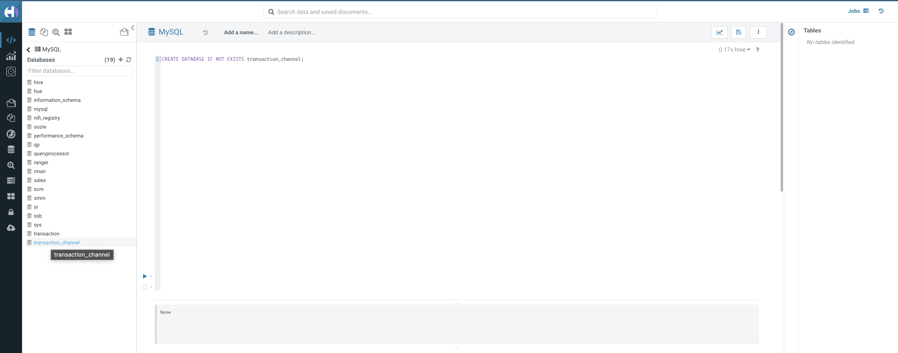

- ### Create table trx_atm, trx_online, trx_edc
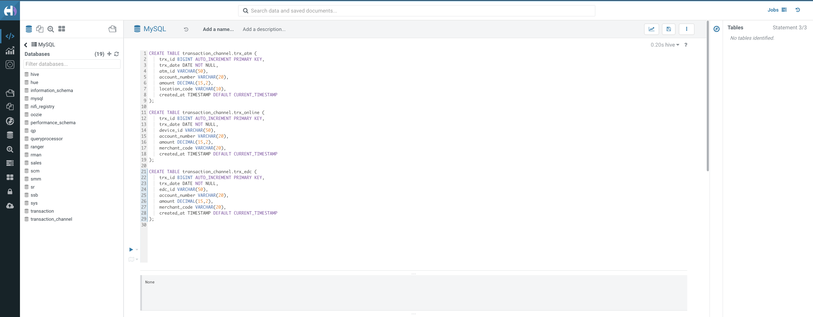
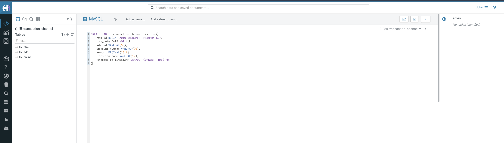
--- 
## INJECT DATA TO MYSQL USING JOB CML
- ### Create project CML
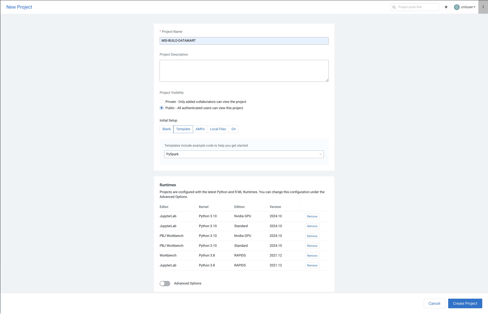
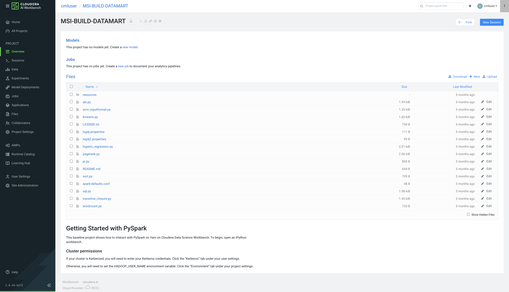
- ### Upload script to project
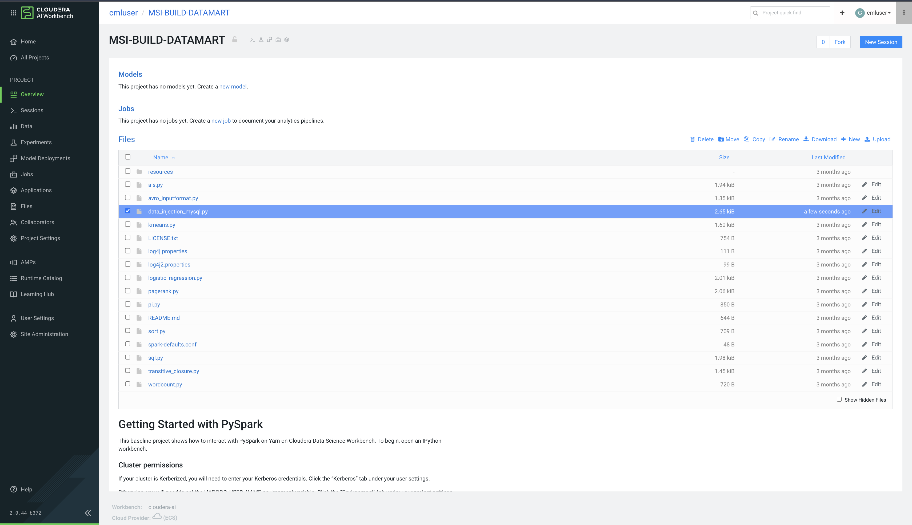

```
from pyspark.sql import SparkSession
from pyspark.sql.types import *
from faker import Faker
import random

# Create Spark session with auto JDBC driver from Maven
spark = SparkSession.builder \
    .appName("Inject_100M_Data_MySQL") \
    .config("spark.jars.packages", "mysql:mysql-connector-java:8.0.33") \
    .getOrCreate()

# JDBC Config
jdbc_url = "jdbc:mysql://cdpm1.cloudeka.ai:3306/transaction_channel?useSSL=false&serverTimezone=UTC&connectionTimeZone=Asia/Jakarta"
jdbc_properties = {
    "user": "cloudera",
    "password": "Admin123",
    "driver": "com.mysql.cj.jdbc.Driver"
}

# Config generate data
TOTAL_RECORDS = 100_000_000
BATCH_SIZE = 1_000_000  
fake = Faker('id_ID')

# Generate data functions per table
def generate_trx_atm():
    data = []
    for _ in range(BATCH_SIZE):
        data.append((
            fake.date_between(start_date='-1y', end_date='today'),
            fake.uuid4(),
            fake.bban(),
            round(random.uniform(10000, 1000000), 2),
            fake.postcode()
        ))
    schema = StructType([
        StructField("trx_date", DateType()),
        StructField("atm_id", StringType()),
        StructField("account_number", StringType()),
        StructField("amount", DoubleType()),
        StructField("location_code", StringType()),
    ])
    return spark.createDataFrame(data, schema)

def generate_trx_online():
    data = []
    for _ in range(BATCH_SIZE):
        data.append((
            fake.date_between(start_date='-1y', end_date='today'),
            fake.uuid4(),
            fake.bban(),
            round(random.uniform(10000, 1000000), 2),
            fake.swift()
        ))
    schema = StructType([
        StructField("trx_date", DateType()),
        StructField("device_id", StringType()),
        StructField("account_number", StringType()),
        StructField("amount", DoubleType()),
        StructField("merchant_code", StringType()),
    ])
    return spark.createDataFrame(data, schema)

def generate_trx_edc():
    data = []
    for _ in range(BATCH_SIZE):
        data.append((
            fake.date_between(start_date='-1y', end_date='today'),
            fake.uuid4(),
            fake.bban(),
            round(random.uniform(10000, 1000000), 2),
            fake.swift()
        ))
    schema = StructType([
        StructField("trx_date", DateType()),
        StructField("edc_id", StringType()),
        StructField("account_number", StringType()),
        StructField("amount", DoubleType()),
        StructField("merchant_code", StringType()),
    ])
    return spark.createDataFrame(data, schema)

# Injection loop per table
for i in range(TOTAL_RECORDS // BATCH_SIZE):
    print(f"=== Batch {i+1}/{TOTAL_RECORDS//BATCH_SIZE} trx_atm ===")
    df_atm = generate_trx_atm()
    df_atm.write.jdbc(url=jdbc_url, table="trx_atm", mode="append", properties=jdbc_properties)

    print(f"=== Batch {i+1}/{TOTAL_RECORDS//BATCH_SIZE} trx_online ===")
    df_online = generate_trx_online()
    df_online.write.jdbc(url=jdbc_url, table="trx_online", mode="append", properties=jdbc_properties)

    print(f"=== Batch {i+1}/{TOTAL_RECORDS//BATCH_SIZE} trx_edc ===")
    df_edc = generate_trx_edc()
    df_edc.write.jdbc(url=jdbc_url, table="trx_edc", mode="append", properties=jdbc_properties)

print("✅ Injection of 100 million records finished")

```

- ### Create Job in CML
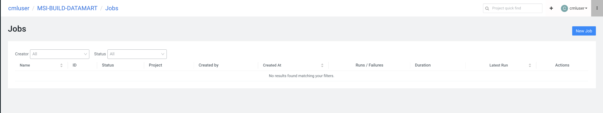
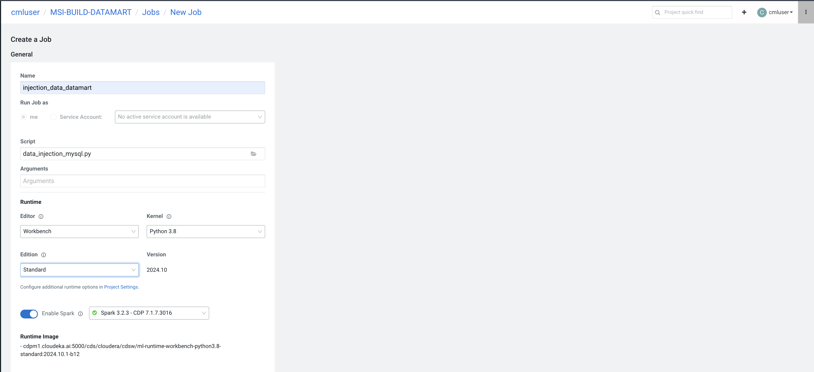
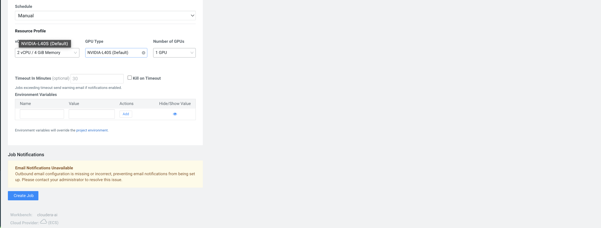
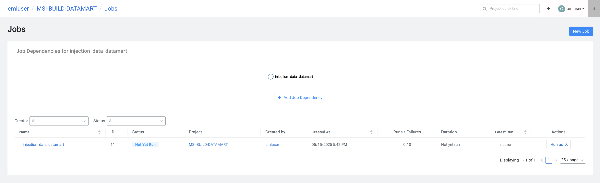

Running Job
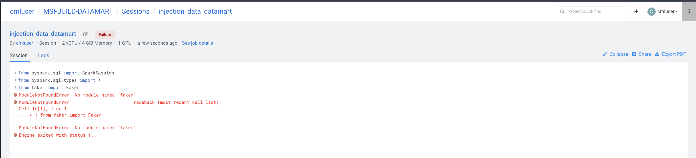
```
Note : Need install module
```
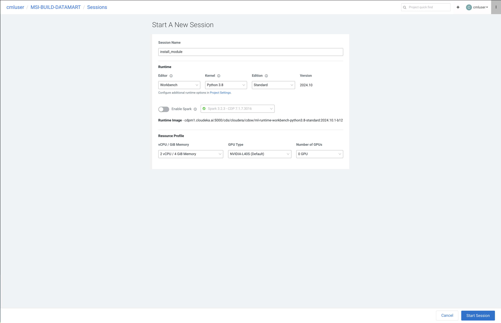
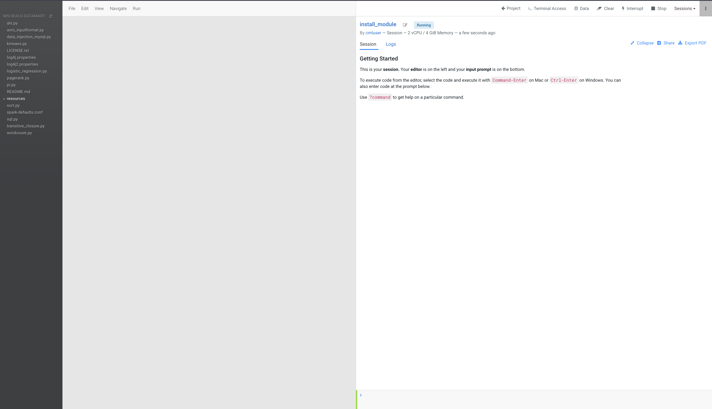
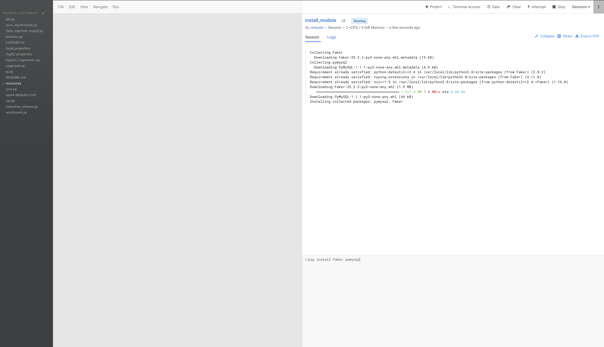
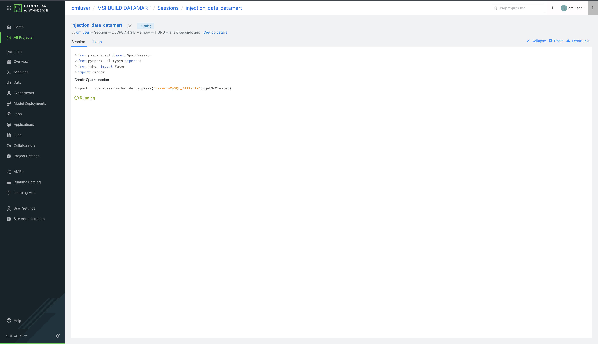

Running job again
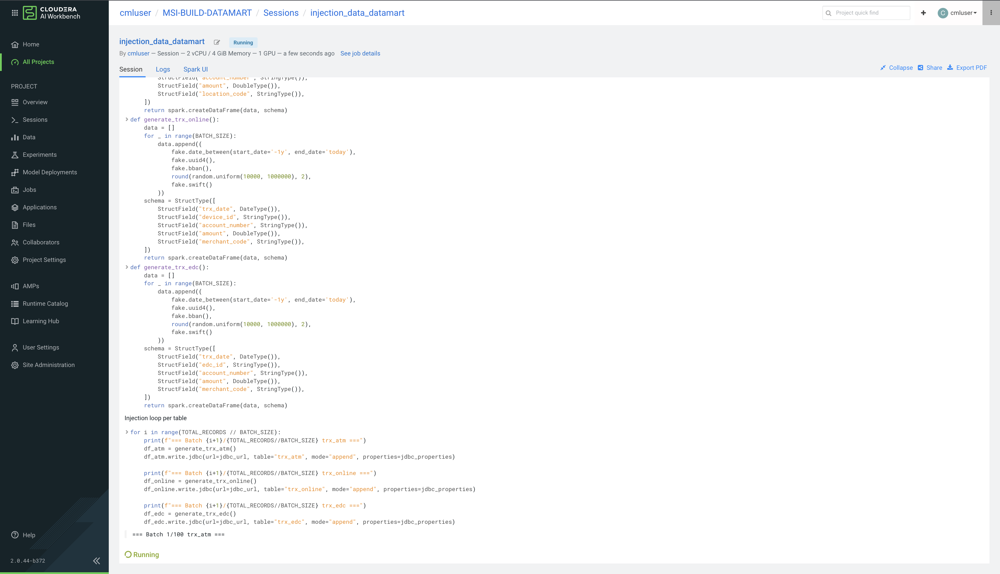
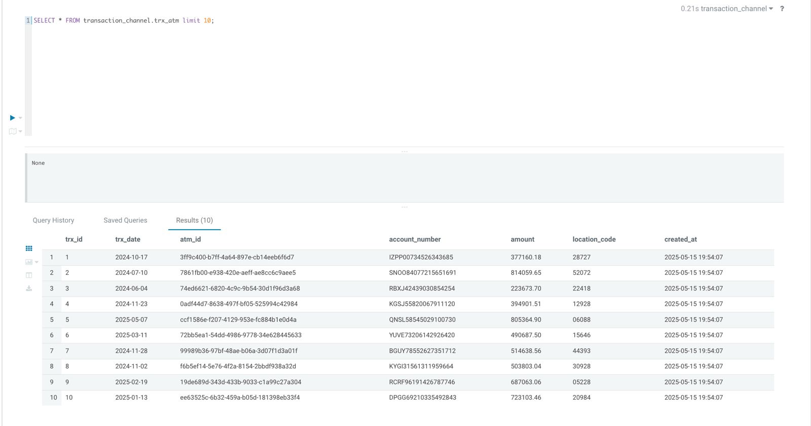